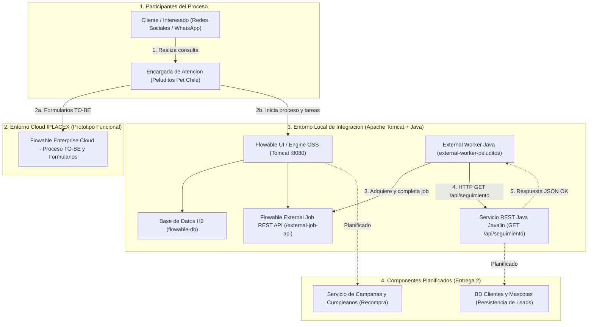

## 1. Diagrama de Arquitectura de Componentes

```mermaid
flowchart TB
    subgraph Actores["1. Participantes del Proceso"]
        Cliente["Cliente / Interesado (Redes Sociales / WhatsApp)"]
        Encargada["Encargada de Atencion (Peluditos Pet Chile)"]
    end

    subgraph Cloud["2. Entorno Cloud IPLACEX (Prototipo Funcional)"]
        FE["Flowable Enterprise Cloud - Proceso TO-BE y Formularios"]
    end

    subgraph LocalOSS["3. Entorno Local de Integracion (Apache Tomcat + Java)"]
        FUI["Flowable UI / Engine OSS (Tomcat :8080)"]
        FAPI["Flowable External Job REST API (/external-job-api)"]
        H2["Base de Datos H2 (flowable-db)"]
        Worker["External Worker Java (external-worker-peluditos)"]
        RestSvc["Servicio REST Java Javalin (GET /api/seguimiento)"]
    end

    subgraph Planificado["4. Componentes Planificados (Entrega 2)"]
        DBClientes["BD Clientes y Mascotas (Persistencia de Leads)"]
        Notif["Servicio de Campanas y Cumpleanos (Recompra)"]
    end

    Cliente -->|1. Realiza consulta| Encargada
    Encargada -->|2a. Formularios TO-BE| FE
    Encargada -->|2b. Inicia proceso y tareas| FUI
    FUI --> H2
    FUI --> FAPI
    Worker -->|3. Adquiere y completa job| FAPI
    Worker -->|4. HTTP GET /api/seguimiento| RestSvc
    RestSvc -.->|5. Respuesta JSON OK| Worker
    RestSvc -.->|Planificado| DBClientes
    FUI -.->|Planificado| Notif
```
